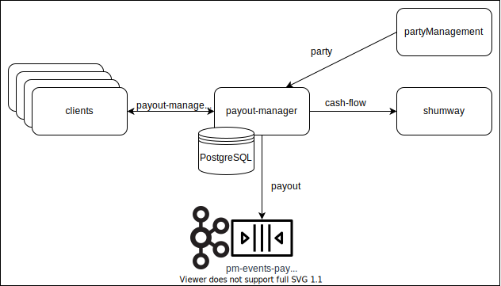

# payout-manager

Сервис для создания и управления выплатами, а также генераций событий создания и изменения выплаты.

Имплементирует сервис `PayoutManagement` протокола https://github.com/rbkmoney/payout-manager-proto

### Описание

Единственной внешней точкой входа в сервис является API `payout-manager-proto`, через это API клиент получает возможность создавать выплату, получить по ней информацию, подтвердить или отменить. При создании или изменении статуса выплаты основной задачей сервиса `payout-manager` является проксирование вызова до сервиса `shumway`, затем результат вызова (создание или изменение статуса) посылается в виде события с состоянием `PayoutChange` и снепшотом актуальной выплаты `Payout` в топик кафки `pm-events-payout`

### Внешние зависимости
#### БД
